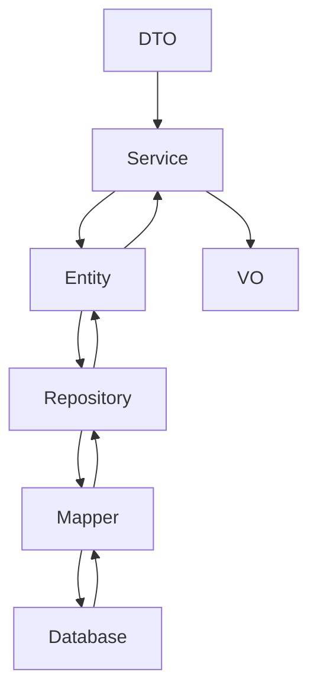

# 项目架构文档

## 1. 整体架构

### 1.1 四层架构
```
┌─────────────────┐
│   Controller层   │  ← HTTP请求处理，参数校验，响应封装
├─────────────────┤
│    Service层     │  ← 业务逻辑处理，事务控制，缓存管理
├─────────────────┤
│  Repository层    │  ← 数据访问封装，隐藏ORM实现细节
├─────────────────┤
│    Mapper层      │  ← 数据库操作，SQL映射
└─────────────────┘
```

### 1.2 数据流转


## 2. 核心模块

### 2.1 RBAC权限系统
- 用户-角色-权限三级模型
- 基于注解的权限控制
- 动态权限配置

### 2.2 日志管理系统
- 审计日志：记录用户操作
- 系统日志：记录运行状态
- 登录日志：记录登录信息

### 2.3 缓存系统
- Redis缓存
- 多级缓存架构
- 缓存同步机制

## 3. 技术栈

### 3.1 核心框架
- Spring Boot 2.7.18
- MyBatis-Plus 3.5.3.1
- Spring Security

### 3.2 存储
- MySQL 8.0.33
- Redis 6.0+
- Druid 1.2.20

### 3.3 工具
- FastJSON2 2.0.43
- Apache Commons
- Swagger/OpenAPI

## 4. 设计模式应用

### 4.1 结构型模式
- 代理模式：AOP切面实现
- 适配器模式：数据转换层
- 外观模式：Service封装

### 4.2 创建型模式
- 工厂方法：对象创建
- 建造者模式：复杂对象构建
- 单例模式：全局对象

### 4.3 行为型模式
- 策略模式：多样化业务处理
- 观察者模式：事件处理
- 模板方法：通用流程

## 5. 安全架构

### 5.1 认证体系
- JWT Token认证
- 密码加密存储
- 会话管理

### 5.2 授权体系
- RBAC权限模型
- URL级别权限控制
- 方法级别权限控制

### 5.3 安全防护
- XSS防护
- SQL注入防护
- CSRF防护

## 6. 性能优化

### 6.1 数据库优化
- 连接池配置
- 索引优化
- SQL优化

### 6.2 缓存优化
- 多级缓存
- 缓存预热
- 缓存更新策略

### 6.3 JVM优化
- 内存配置
- GC策略
- 线程池配置

## 7. 监控体系

### 7.1 系统监控
- 服务器监控
- JVM监控
- 线程监控

### 7.2 业务监控
- 接口调用监控
- 业务指标监控
- 用户行为分析

### 7.3 日志监控
- 错误日志监控
- 性能日志监控
- 审计日志分析

## 8. 扩展性设计

### 8.1 水平扩展
- 无状态设计
- 分布式Session
- 负载均衡

### 8.2 垂直扩展
- 模块化设计
- 插件化架构
- 服务化拆分

### 8.3 数据扩展
- 分库分表
- 读写分离
- 数据归档 