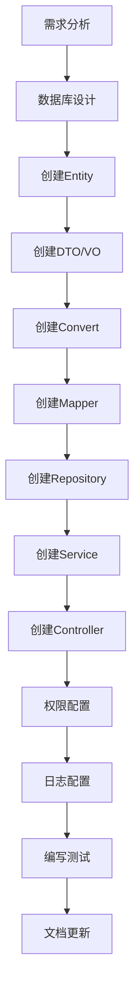

# 新功能拓展规范和流程

本文档指导开发人员如何在Biou项目中正确地添加新功能，确保功能扩展符合项目架构和编码规范。

## 📋 目录

- [1. 功能开发流程](#1-功能开发流程)
- [2. 数据库设计](#2-数据库设计)
- [3. 代码层次实现](#3-代码层次实现)
- [4. 权限集成](#4-权限集成)
- [5. 日志集成](#5-日志集成)
- [6. 测试编写](#6-测试编写)
- [7. 实际案例](#7-实际案例)

## 1. 功能开发流程

### 1.1 需求分析阶段

**步骤1：需求梳理**
- 明确功能边界和业务规则
- 确定涉及的实体和关系
- 设计API接口规范
- 确定权限控制要求

**步骤2：技术设计**
- 设计数据库表结构
- 规划四层架构实现
- 确定DTO/VO结构
- 设计缓存策略

### 1.2 开发实施阶段



### 1.3 验收测试阶段

- 功能测试
- 权限测试
- 性能测试
- 安全测试
- 文档检查

## 2. 数据库设计

### 2.1 表设计规范

**表命名：** `t_{功能模块}`

**必备字段：**
```sql
CREATE TABLE `t_example` (
  `id` bigint(20) NOT NULL AUTO_INCREMENT COMMENT '主键ID',
  -- 业务字段...
  `status` tinyint(1) NOT NULL DEFAULT '1' COMMENT '状态：0-禁用，1-启用',
  `create_time` datetime NOT NULL DEFAULT CURRENT_TIMESTAMP COMMENT '创建时间',
  `update_time` datetime NOT NULL DEFAULT CURRENT_TIMESTAMP ON UPDATE CURRENT_TIMESTAMP COMMENT '更新时间',
  `deleted` tinyint(1) NOT NULL DEFAULT '0' COMMENT '逻辑删除：0-未删除，1-已删除',
  PRIMARY KEY (`id`)
) ENGINE=InnoDB DEFAULT CHARSET=utf8mb4 COMMENT='示例表';
```

### 2.2 索引设计

```sql
-- 唯一索引（业务唯一字段）
UNIQUE KEY `uk_code` (`code`),

-- 普通索引（查询字段）
KEY `idx_status` (`status`),
KEY `idx_create_time` (`create_time`),

-- 复合索引（联合查询字段）
KEY `idx_status_type` (`status`, `type`)
```

### 2.3 初始化数据

```sql
-- 插入初始化数据
INSERT INTO `t_example` (`id`, `code`, `name`, `status`) VALUES
(1, 'EXAMPLE_001', '示例数据1', 1),
(2, 'EXAMPLE_002', '示例数据2', 1);
```

## 3. 代码层次实现

### 3.1 Entity层

```java
/**
 * 示例实体类
 */
public class Example {
    
    /**
     * 主键ID
     */
    @TableId(value = "id", type = IdType.AUTO)
    private Long id;
    
    /**
     * 编码
     */
    private String code;
    
    /**
     * 名称
     */
    private String name;
    
    /**
     * 状态：0-禁用，1-启用
     */
    private Integer status;
    
    /**
     * 创建时间
     */
    @TableField(fill = FieldFill.INSERT)
    private LocalDateTime createTime;
    
    /**
     * 更新时间
     */
    @TableField(fill = FieldFill.INSERT_UPDATE)
    private LocalDateTime updateTime;
    
    /**
     * 逻辑删除：0-未删除，1-已删除
     */
    @TableLogic
    private Integer deleted;
    
    // 构造函数、getter、setter、toString方法...
}
```

### 3.2 DTO层

**创建DTO：**
```java
public class ExampleCreateDTO {
    
    @NotBlank(message = "编码不能为空")
    @Size(max = 50, message = "编码长度不能超过50")
    private String code;
    
    @NotBlank(message = "名称不能为空")
    @Size(max = 100, message = "名称长度不能超过100")
    private String name;
    
    private String description;
    
    // 构造函数、getter、setter、toString方法...
}
```

**查询DTO：**
```java
public class ExampleQueryDTO extends PageQueryDTO {
    
    private String code;
    private String name;
    private Integer status;
    
    @DateTimeFormat(pattern = "yyyy-MM-dd HH:mm:ss")
    private LocalDateTime createTimeStart;
    
    @DateTimeFormat(pattern = "yyyy-MM-dd HH:mm:ss")
    private LocalDateTime createTimeEnd;
    
    // 构造函数、getter、setter、toString方法...
}
```

**更新DTO：**
```java
public class ExampleUpdateDTO {
    
    @Size(max = 100, message = "名称长度不能超过100")
    private String name;
    
    private String description;
    private Integer status;
    
    // 构造函数、getter、setter、toString方法...
}
```

### 3.3 VO层

```java
public class ExampleVO {
    
    private Long id;
    private String code;
    private String name;
    private String description;
    private Integer status;
    private String statusName;
    
    @JsonFormat(pattern = "yyyy-MM-dd HH:mm:ss")
    private LocalDateTime createTime;
    
    @JsonFormat(pattern = "yyyy-MM-dd HH:mm:ss")
    private LocalDateTime updateTime;
    
    // 构造函数、getter、setter、toString方法...
}
```

### 3.4 Convert层

```java
public class ExampleConvert {
    
    public static Example toEntity(ExampleCreateDTO createDTO) {
        if (createDTO == null) {
            return null;
        }
        
        Example example = new Example();
        example.setCode(createDTO.getCode());
        example.setName(createDTO.getName());
        example.setDescription(createDTO.getDescription());
        example.setStatus(ExampleConstants.Status.ACTIVE);
        return example;
    }
    
    public static ExampleVO toVO(Example example) {
        if (example == null) {
            return null;
        }
        
        ExampleVO exampleVO = new ExampleVO();
        exampleVO.setId(example.getId());
        exampleVO.setCode(example.getCode());
        exampleVO.setName(example.getName());
        exampleVO.setDescription(example.getDescription());
        exampleVO.setStatus(example.getStatus());
        exampleVO.setStatusName(ExampleConstants.getStatusName(example.getStatus()));
        exampleVO.setCreateTime(example.getCreateTime());
        exampleVO.setUpdateTime(example.getUpdateTime());
        return exampleVO;
    }
    
    public static List<ExampleVO> toVOList(List<Example> examples) {
        if (examples == null || examples.isEmpty()) {
            return new ArrayList<>();
        }
        
        return examples.stream()
                .map(ExampleConvert::toVO)
                .collect(Collectors.toList());
    }
    
    public static void updateEntity(Example example, ExampleUpdateDTO updateDTO) {
        if (updateDTO.getName() != null) {
            example.setName(updateDTO.getName());
        }
        if (updateDTO.getDescription() != null) {
            example.setDescription(updateDTO.getDescription());
        }
        if (updateDTO.getStatus() != null) {
            example.setStatus(updateDTO.getStatus());
        }
    }
}
```

### 3.5 Mapper层

```java
/**
 * Example Mapper接口
 */
@Mapper
public interface ExampleMapper extends BaseMapper<Example> {
    
    /**
     * 根据编码查询（自定义SQL示例）
     */
    @Select("SELECT * FROM t_example WHERE code = #{code} AND deleted = 0")
    Example selectByCode(@Param("code") String code);
    
    /**
     * 统计指定状态的记录数（自定义SQL示例）
     */
    @Select("SELECT COUNT(*) FROM t_example WHERE status = #{status} AND deleted = 0")
    Long countByStatus(@Param("status") Integer status);
}
```

### 3.6 Repository层

**接口定义：**
```java
public interface ExampleRepository extends IService<Example> {
    
    /**
     * 根据条件查询单个示例
     */
    Example findOne(ExampleQueryDTO queryDTO);
    
    /**
     * 根据条件查询示例列表
     */
    List<Example> list(ExampleQueryDTO queryDTO);
    
    /**
     * 根据条件分页查询示例
     */
    Page<Example> page(Page<Example> page, ExampleQueryDTO queryDTO);
    
    /**
     * 根据条件统计示例数量
     */
    Long count(ExampleQueryDTO queryDTO);
    
    /**
     * 根据条件更新示例
     */
    void update(Example entity, ExampleQueryDTO queryDTO);
    
    /**
     * 根据条件删除示例
     */
    void remove(ExampleQueryDTO queryDTO);
    
    /**
     * 根据编码查询示例
     */
    Example findByCode(String code);
}
```

**实现类：**
```java
@Repository
public class ExampleRepositoryImpl extends ServiceImpl<ExampleMapper, Example> 
    implements ExampleRepository {
    
    @Override
    public Example findOne(ExampleQueryDTO queryDTO) {
        LambdaQueryWrapper<Example> wrapper = QueryWrapperUtils.buildExampleQueryWrapper(queryDTO);
        return baseMapper.selectOne(wrapper);
    }
    
    @Override
    public List<Example> list(ExampleQueryDTO queryDTO) {
        LambdaQueryWrapper<Example> wrapper = QueryWrapperUtils.buildExampleQueryWrapper(queryDTO);
        return baseMapper.selectList(wrapper);
    }
    
    @Override
    public Page<Example> page(Page<Example> page, ExampleQueryDTO queryDTO) {
        LambdaQueryWrapper<Example> wrapper = QueryWrapperUtils.buildExampleQueryWrapper(queryDTO);
        return baseMapper.selectPage(page, wrapper);
    }
    
    @Override
    public Long count(ExampleQueryDTO queryDTO) {
        LambdaQueryWrapper<Example> wrapper = QueryWrapperUtils.buildExampleQueryWrapper(queryDTO);
        return baseMapper.selectCount(wrapper);
    }
    
    @Override
    public void update(Example entity, ExampleQueryDTO queryDTO) {
        LambdaUpdateWrapper<Example> wrapper = QueryWrapperUtils.buildExampleUpdateWrapper(queryDTO);
        int result = baseMapper.update(entity, wrapper);
        if (result == 0) {
            throw new BusinessException("更新失败，数据不存在或已被修改");
        }
    }
    
    @Override
    public void remove(ExampleQueryDTO queryDTO) {
        LambdaQueryWrapper<Example> wrapper = QueryWrapperUtils.buildExampleQueryWrapper(queryDTO);
        int result = baseMapper.delete(wrapper);
        if (result == 0) {
            throw new BusinessException("删除失败，数据不存在");
        }
    }
    
    @Override
    public Example findByCode(String code) {
        return baseMapper.selectByCode(code);
    }
}
```

### 3.7 Service层

**接口定义：**
```java
public interface ExampleService {
    
    /**
     * 创建示例
     */
    ExampleVO createExample(ExampleCreateDTO createDTO);
    
    /**
     * 根据ID查询示例
     */
    ExampleVO getExampleById(Long id);
    
    /**
     * 分页查询示例
     */
    Page<ExampleVO> pageExamples(ExampleQueryDTO queryDTO);
    
    /**
     * 更新示例
     */
    void updateExample(Long id, ExampleUpdateDTO updateDTO);
    
    /**
     * 删除示例
     */
    void deleteExample(Long id);
    
    /**
     * 批量删除示例
     */
    void deleteExamples(List<Long> ids);
    
    /**
     * 根据编码查询示例
     */
    ExampleVO getExampleByCode(String code);
}
```

**实现类：**
```java
@Service
@Transactional(rollbackFor = Exception.class)
public class ExampleServiceImpl implements ExampleService {
    
    private static final Logger logger = LoggerFactory.getLogger(ExampleServiceImpl.class);
    
    @Autowired
    private ExampleRepository exampleRepository;
    
    @Autowired
    private RedisUtils redisUtils;
    
    @Override
    public ExampleVO createExample(ExampleCreateDTO createDTO) {
        logger.info("创建示例开始，参数：{}", createDTO);
        
        try {
            // 1. 业务校验
            validateCreateExample(createDTO);
            
            // 2. 数据转换
            Example example = ExampleConvert.toEntity(createDTO);
            
            // 3. 数据保存
            exampleRepository.save(example);
            
            // 4. 缓存处理
            handleCacheAfterCreate(example);
            
            // 5. 结果转换
            ExampleVO result = ExampleConvert.toVO(example);
            
            logger.info("创建示例成功，ID：{}", example.getId());
            return result;
            
        } catch (Exception e) {
            logger.error("创建示例失败", e);
            throw e;
        }
    }
    
    @Override
    @Cacheable(value = "example", key = "#id")
    public ExampleVO getExampleById(Long id) {
        logger.debug("根据ID查询示例：{}", id);
        
        Example example = exampleRepository.getById(id);
        if (example == null) {
            throw new BusinessException("示例不存在");
        }
        
        return ExampleConvert.toVO(example);
    }
    
    @Override
    public Page<ExampleVO> pageExamples(ExampleQueryDTO queryDTO) {
        logger.debug("分页查询示例，参数：{}", queryDTO);
        
        Page<Example> page = new Page<>(queryDTO.getPage(), queryDTO.getSize());
        page = exampleRepository.page(page, queryDTO);
        
        Page<ExampleVO> result = new Page<>(page.getCurrent(), page.getSize(), page.getTotal());
        result.setRecords(ExampleConvert.toVOList(page.getRecords()));
        
        return result;
    }
    
    @Override
    @CacheEvict(value = "example", key = "#id")
    public void updateExample(Long id, ExampleUpdateDTO updateDTO) {
        logger.info("更新示例开始，ID：{}，参数：{}", id, updateDTO);
        
        try {
            // 1. 查询存在性
            Example example = exampleRepository.getById(id);
            if (example == null) {
                throw new BusinessException("示例不存在");
            }
            
            // 2. 业务校验
            validateUpdateExample(id, updateDTO);
            
            // 3. 数据更新
            ExampleConvert.updateEntity(example, updateDTO);
            exampleRepository.updateById(example);
            
            // 4. 缓存处理
            handleCacheAfterUpdate(example);
            
            logger.info("更新示例成功，ID：{}", id);
            
        } catch (Exception e) {
            logger.error("更新示例失败，ID：{}", id, e);
            throw e;
        }
    }
    
    @Override
    @CacheEvict(value = "example", key = "#id")
    public void deleteExample(Long id) {
        logger.info("删除示例开始，ID：{}", id);
        
        try {
            // 1. 查询存在性
            Example example = exampleRepository.getById(id);
            if (example == null) {
                throw new BusinessException("示例不存在");
            }
            
            // 2. 业务校验
            validateDeleteExample(id);
            
            // 3. 逻辑删除
            exampleRepository.removeById(id);
            
            // 4. 缓存处理
            handleCacheAfterDelete(id);
            
            logger.info("删除示例成功，ID：{}", id);
            
        } catch (Exception e) {
            logger.error("删除示例失败，ID：{}", id, e);
            throw e;
        }
    }
    
    @Override
    public void deleteExamples(List<Long> ids) {
        logger.info("批量删除示例开始，IDs：{}", ids);
        
        if (ids == null || ids.isEmpty()) {
            throw new BusinessException("删除ID列表不能为空");
        }
        
        try {
            for (Long id : ids) {
                deleteExample(id);
            }
            
            logger.info("批量删除示例成功，数量：{}", ids.size());
            
        } catch (Exception e) {
            logger.error("批量删除示例失败", e);
            throw e;
        }
    }
    
    @Override
    @Cacheable(value = "example:code", key = "#code")
    public ExampleVO getExampleByCode(String code) {
        logger.debug("根据编码查询示例：{}", code);
        
        Example example = exampleRepository.findByCode(code);
        if (example == null) {
            throw new BusinessException("示例不存在");
        }
        
        return ExampleConvert.toVO(example);
    }
    
    /**
     * 创建校验
     */
    private void validateCreateExample(ExampleCreateDTO createDTO) {
        // 检查编码唯一性
        Example existExample = exampleRepository.findByCode(createDTO.getCode());
        if (existExample != null) {
            throw new BusinessException("编码已存在：" + createDTO.getCode());
        }
    }
    
    /**
     * 更新校验
     */
    private void validateUpdateExample(Long id, ExampleUpdateDTO updateDTO) {
        // 可以添加特定的更新校验逻辑
    }
    
    /**
     * 删除校验
     */
    private void validateDeleteExample(Long id) {
        // 可以添加删除前的校验逻辑，如检查关联数据
    }
    
    /**
     * 创建后缓存处理
     */
    private void handleCacheAfterCreate(Example example) {
        // 清除列表缓存
        redisUtils.deletePattern("example:list:*");
        
        // 设置单个缓存
        redisUtils.set("example:" + example.getId(), example, 3600);
    }
    
    /**
     * 更新后缓存处理
     */
    private void handleCacheAfterUpdate(Example example) {
        // 清除相关缓存
        redisUtils.delete("example:" + example.getId());
        redisUtils.delete("example:code:" + example.getCode());
        redisUtils.deletePattern("example:list:*");
    }
    
    /**
     * 删除后缓存处理
     */
    private void handleCacheAfterDelete(Long id) {
        // 清除相关缓存
        redisUtils.delete("example:" + id);
        redisUtils.deletePattern("example:list:*");
    }
}
```

### 3.8 Controller层

```java
/**
 * 示例管理Controller
 */
@RestController
@RequestMapping("/api/example")
@Validated
public class ExampleController {
    
    @Autowired
    private ExampleService exampleService;
    
    /**
     * 创建示例
     */
    @PostMapping
    @AuditLog(operationType = LogConstants.OperationType.CREATE, 
              businessType = LogConstants.BusinessType.EXAMPLE, 
              module = "示例管理", 
              description = "创建示例")
    @PreAuthorize("hasAuthority('SYSTEM:EXAMPLE:CREATE')")
    public Result<ExampleVO> createExample(@Valid @RequestBody ExampleCreateDTO createDTO) {
        ExampleVO result = exampleService.createExample(createDTO);
        return Result.success(result);
    }
    
    /**
     * 根据ID查询示例
     */
    @GetMapping("/{id}")
    @PreAuthorize("hasAuthority('SYSTEM:EXAMPLE:VIEW')")
    public Result<ExampleVO> getExample(@PathVariable Long id) {
        ExampleVO result = exampleService.getExampleById(id);
        return Result.success(result);
    }
    
    /**
     * 分页查询示例
     */
    @PostMapping("/page")
    @PreAuthorize("hasAuthority('SYSTEM:EXAMPLE:LIST')")
    public Result<Page<ExampleVO>> pageExamples(@Valid @RequestBody ExampleQueryDTO queryDTO) {
        Page<ExampleVO> result = exampleService.pageExamples(queryDTO);
        return Result.success(result);
    }
    
    /**
     * 更新示例
     */
    @PutMapping("/{id}")
    @AuditLog(operationType = LogConstants.OperationType.UPDATE, 
              businessType = LogConstants.BusinessType.EXAMPLE, 
              module = "示例管理", 
              description = "更新示例")
    @PreAuthorize("hasAuthority('SYSTEM:EXAMPLE:UPDATE')")
    public Result<Void> updateExample(@PathVariable Long id, 
                                     @Valid @RequestBody ExampleUpdateDTO updateDTO) {
        exampleService.updateExample(id, updateDTO);
        return Result.success();
    }
    
    /**
     * 删除示例
     */
    @DeleteMapping("/{id}")
    @AuditLog(operationType = LogConstants.OperationType.DELETE, 
              businessType = LogConstants.BusinessType.EXAMPLE, 
              module = "示例管理", 
              description = "删除示例")
    @PreAuthorize("hasAuthority('SYSTEM:EXAMPLE:DELETE')")
    public Result<Void> deleteExample(@PathVariable Long id) {
        exampleService.deleteExample(id);
        return Result.success();
    }
    
    /**
     * 批量删除示例
     */
    @DeleteMapping("/batch")
    @AuditLog(operationType = LogConstants.OperationType.DELETE, 
              businessType = LogConstants.BusinessType.EXAMPLE, 
              module = "示例管理", 
              description = "批量删除示例")
    @PreAuthorize("hasAuthority('SYSTEM:EXAMPLE:DELETE')")
    public Result<Void> deleteExamples(@RequestBody List<Long> ids) {
        exampleService.deleteExamples(ids);
        return Result.success();
    }
    
    /**
     * 根据编码查询示例
     */
    @GetMapping("/code/{code}")
    @PreAuthorize("hasAuthority('SYSTEM:EXAMPLE:VIEW')")
    public Result<ExampleVO> getExampleByCode(@PathVariable String code) {
        ExampleVO result = exampleService.getExampleByCode(code);
        return Result.success(result);
    }
}
```

## 4. 权限集成

### 4.1 权限数据初始化

```sql
-- 1. 插入权限数据
INSERT INTO `t_permission` (`permission_code`, `permission_name`, `resource_type`, `parent_id`, `sort_order`, `description`) VALUES
('SYSTEM:EXAMPLE', '示例管理', 'menu', 1, 400, '示例管理模块'),
('SYSTEM:EXAMPLE:LIST', '示例列表', 'api', (SELECT id FROM t_permission WHERE permission_code = 'SYSTEM:EXAMPLE'), 401, '查看示例列表'),
('SYSTEM:EXAMPLE:VIEW', '示例详情', 'api', (SELECT id FROM t_permission WHERE permission_code = 'SYSTEM:EXAMPLE'), 402, '查看示例详情'),
('SYSTEM:EXAMPLE:CREATE', '创建示例', 'api', (SELECT id FROM t_permission WHERE permission_code = 'SYSTEM:EXAMPLE'), 403, '创建新示例'),
('SYSTEM:EXAMPLE:UPDATE', '更新示例', 'api', (SELECT id FROM t_permission WHERE permission_code = 'SYSTEM:EXAMPLE'), 404, '更新示例信息'),
('SYSTEM:EXAMPLE:DELETE', '删除示例', 'api', (SELECT id FROM t_permission WHERE permission_code = 'SYSTEM:EXAMPLE'), 405, '删除示例');

-- 2. 为ADMIN角色分配权限
INSERT INTO `t_role_permission` (`role_id`, `permission_id`) 
SELECT r.id, p.id 
FROM t_role r, t_permission p 
WHERE r.role_code = 'ADMIN' 
AND p.permission_code LIKE 'SYSTEM:EXAMPLE%';
```

### 4.2 权限常量定义

```java
public class ExamplePermissions {
    public static final String MODULE = "SYSTEM:EXAMPLE";
    public static final String LIST = "SYSTEM:EXAMPLE:LIST";
    public static final String VIEW = "SYSTEM:EXAMPLE:VIEW";
    public static final String CREATE = "SYSTEM:EXAMPLE:CREATE";
    public static final String UPDATE = "SYSTEM:EXAMPLE:UPDATE";
    public static final String DELETE = "SYSTEM:EXAMPLE:DELETE";
}
```

## 5. 日志集成

### 5.1 业务类型定义

```java
public class LogConstants {
    public static class BusinessType {
        public static final String EXAMPLE = "EXAMPLE";  // 添加新的业务类型
    }
}
```

### 5.2 日志使用

```java
// 在Controller方法上添加审计日志注解
@AuditLog(
    operationType = LogConstants.OperationType.CREATE,
    businessType = LogConstants.BusinessType.EXAMPLE,
    module = "示例管理",
    description = "创建示例"
)
```

## 6. 测试编写

### 6.1 单元测试

```java
@SpringBootTest
@Transactional
class ExampleServiceTest {
    
    @Autowired
    private ExampleService exampleService;
    
    @MockBean
    private ExampleRepository exampleRepository;
    
    @Test
    @DisplayName("创建示例成功")
    void testCreateExampleSuccess() {
        // Given
        ExampleCreateDTO createDTO = new ExampleCreateDTO();
        createDTO.setCode("TEST001");
        createDTO.setName("测试示例");
        
        Example savedExample = new Example();
        savedExample.setId(1L);
        savedExample.setCode("TEST001");
        
        when(exampleRepository.findByCode("TEST001")).thenReturn(null);
        when(exampleRepository.save(any(Example.class))).thenReturn(savedExample);
        
        // When
        ExampleVO result = exampleService.createExample(createDTO);
        
        // Then
        assertThat(result).isNotNull();
        assertThat(result.getId()).isEqualTo(1L);
        assertThat(result.getCode()).isEqualTo("TEST001");
    }
    
    @Test
    @DisplayName("创建示例失败-编码重复")
    void testCreateExampleFailCodeDuplicate() {
        // Given
        ExampleCreateDTO createDTO = new ExampleCreateDTO();
        createDTO.setCode("EXIST001");
        
        Example existExample = new Example();
        existExample.setId(1L);
        existExample.setCode("EXIST001");
        
        when(exampleRepository.findByCode("EXIST001")).thenReturn(existExample);
        
        // When & Then
        assertThatThrownBy(() -> exampleService.createExample(createDTO))
                .isInstanceOf(BusinessException.class)
                .hasMessage("编码已存在：EXIST001");
    }
}
```

### 6.2 集成测试

```java
@SpringBootTest(webEnvironment = SpringBootTest.WebEnvironment.RANDOM_PORT)
@AutoConfigureTestDatabase(replace = AutoConfigureTestDatabase.Replace.NONE)
@Sql(scripts = "/sql/example-test-data.sql", executionPhase = Sql.ExecutionPhase.BEFORE_TEST_METHOD)
@Sql(scripts = "/sql/example-cleanup.sql", executionPhase = Sql.ExecutionPhase.AFTER_TEST_METHOD)
class ExampleControllerIntegrationTest {
    
    @Autowired
    private TestRestTemplate restTemplate;
    
    @Test
    @DisplayName("创建示例API测试")
    void testCreateExampleAPI() {
        // Given
        ExampleCreateDTO createDTO = new ExampleCreateDTO();
        createDTO.setCode("API001");
        createDTO.setName("API测试示例");
        
        // When
        ResponseEntity<Result> response = restTemplate.postForEntity(
                "/api/example", createDTO, Result.class);
        
        // Then
        assertThat(response.getStatusCode()).isEqualTo(HttpStatus.OK);
        assertThat(response.getBody().getCode()).isEqualTo(200);
    }
}
```

## 7. 实际案例

### 7.1 添加文章管理功能

假设我们要添加一个文章管理功能，包含文章的增删改查操作。

**步骤1：数据库设计**
```sql
CREATE TABLE `t_article` (
  `id` bigint(20) NOT NULL AUTO_INCREMENT COMMENT '主键ID',
  `title` varchar(200) NOT NULL COMMENT '文章标题',
  `content` longtext COMMENT '文章内容',
  `author_id` bigint(20) NOT NULL COMMENT '作者ID',
  `category_id` bigint(20) DEFAULT NULL COMMENT '分类ID',
  `status` tinyint(1) NOT NULL DEFAULT '1' COMMENT '状态：0-草稿，1-已发布',
  `view_count` int(11) NOT NULL DEFAULT '0' COMMENT '浏览次数',
  `create_time` datetime NOT NULL DEFAULT CURRENT_TIMESTAMP COMMENT '创建时间',
  `update_time` datetime NOT NULL DEFAULT CURRENT_TIMESTAMP ON UPDATE CURRENT_TIMESTAMP COMMENT '更新时间',
  `deleted` tinyint(1) NOT NULL DEFAULT '0' COMMENT '逻辑删除：0-未删除，1-已删除',
  PRIMARY KEY (`id`),
  KEY `idx_author_id` (`author_id`),
  KEY `idx_category_id` (`category_id`),
  KEY `idx_status` (`status`),
  KEY `idx_create_time` (`create_time`)
) ENGINE=InnoDB DEFAULT CHARSET=utf8mb4 COMMENT='文章表';
```

**步骤2：创建实体类**
```java
public class Article {
    @TableId(value = "id", type = IdType.AUTO)
    private Long id;
    
    private String title;
    private String content;
    private Long authorId;
    private Long categoryId;
    private Integer status;
    private Integer viewCount;
    
    @TableField(fill = FieldFill.INSERT)
    private LocalDateTime createTime;
    
    @TableField(fill = FieldFill.INSERT_UPDATE)
    private LocalDateTime updateTime;
    
    @TableLogic
    private Integer deleted;
    
    // 构造函数、getter、setter、toString
}
```

**步骤3：创建DTO和VO**
```java
// 创建DTO
public class ArticleCreateDTO {
    @NotBlank(message = "标题不能为空")
    @Size(max = 200, message = "标题长度不能超过200")
    private String title;
    
    @NotBlank(message = "内容不能为空")
    private String content;
    
    private Long categoryId;
    
    // 构造函数、getter、setter、toString
}

// 查询DTO
public class ArticleQueryDTO extends PageQueryDTO {
    private String title;
    private Long authorId;
    private Long categoryId;
    private Integer status;
    private LocalDateTime createTimeStart;
    private LocalDateTime createTimeEnd;
    
    // 构造函数、getter、setter、toString
}

// 响应VO
public class ArticleVO {
    private Long id;
    private String title;
    private String content;
    private Long authorId;
    private String authorName;
    private Long categoryId;
    private String categoryName;
    private Integer status;
    private String statusName;
    private Integer viewCount;
    
    @JsonFormat(pattern = "yyyy-MM-dd HH:mm:ss")
    private LocalDateTime createTime;
    
    @JsonFormat(pattern = "yyyy-MM-dd HH:mm:ss")
    private LocalDateTime updateTime;
    
    // 构造函数、getter、setter、toString
}
```

**步骤4：按照前面的规范实现各层代码**

**步骤5：配置权限**
```sql
-- 插入文章管理权限
INSERT INTO `t_permission` (`permission_code`, `permission_name`, `resource_type`, `parent_id`, `sort_order`, `description`) VALUES
('BUSINESS:ARTICLE', '文章管理', 'menu', (SELECT id FROM t_permission WHERE permission_code = 'BUSINESS'), 201, '文章管理模块'),
('BUSINESS:ARTICLE:LIST', '文章列表', 'api', (SELECT id FROM t_permission WHERE permission_code = 'BUSINESS:ARTICLE'), 202, '查看文章列表'),
('BUSINESS:ARTICLE:VIEW', '文章详情', 'api', (SELECT id FROM t_permission WHERE permission_code = 'BUSINESS:ARTICLE'), 203, '查看文章详情'),
('BUSINESS:ARTICLE:CREATE', '创建文章', 'api', (SELECT id FROM t_permission WHERE permission_code = 'BUSINESS:ARTICLE'), 204, '创建新文章'),
('BUSINESS:ARTICLE:UPDATE', '更新文章', 'api', (SELECT id FROM t_permission WHERE permission_code = 'BUSINESS:ARTICLE'), 205, '更新文章'),
('BUSINESS:ARTICLE:DELETE', '删除文章', 'api', (SELECT id FROM t_permission WHERE permission_code = 'BUSINESS:ARTICLE'), 206, '删除文章');
```

**步骤6：编写测试**

**步骤7：更新文档**

## 📝 功能开发检查清单

开发新功能时，请确保以下检查项都已完成：

### 设计阶段
- [ ] 需求分析明确，边界清晰
- [ ] 数据库表设计符合规范
- [ ] API接口设计合理
- [ ] 权限控制方案确定

### 实现阶段
- [ ] Entity类包含必备字段
- [ ] DTO类有适当的校验注解
- [ ] VO类有JSON格式化注解
- [ ] Convert类处理null值
- [ ] Repository接口使用DTO封装
- [ ] Service类有完整的业务逻辑
- [ ] Controller类有权限检查和审计日志

### 质量保证
- [ ] 单元测试覆盖主要场景
- [ ] 集成测试验证API功能
- [ ] 异常处理完整
- [ ] 日志记录适当
- [ ] 缓存策略合理

### 文档更新
- [ ] API文档更新
- [ ] 数据库文档更新
- [ ] 权限配置文档更新
- [ ] 部署说明更新

---

按照此规范开发新功能，可以确保功能质量和系统的一致性。 