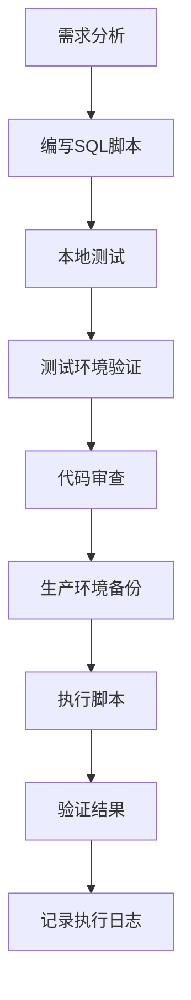

# SQL 文件编写规范

## 概述

本文档定义了在生产环境中执行SQL脚本的标准和最佳实践，包括添加新字段、数据、表格等数据库结构变更操作。

## 目录

- [通用原则](#通用原则)
- [使用指南](#使用指南)
- [环境准备](#环境准备)
- [操作步骤](#操作步骤)
- [文件组织结构](#文件组织结构)
- [DDL 操作规范](#ddl-操作规范)
- [DML 操作规范](#dml-操作规范)
- [命名规范](#命名规范)
- [安全和性能](#安全和性能)
- [版本控制](#版本控制)
- [执行流程](#执行流程)
- [回滚策略](#回滚策略)
- [示例模板](#示例模板)
- [常见问题](#常见问题)
- [工具推荐](#工具推荐)

## 通用原则

### 1. 安全第一
- 所有生产环境的SQL变更必须经过测试环境验证
- 必须具备回滚方案
- 大批量数据操作需要分批执行
- 禁止直接在生产环境执行未经测试的SQL

### 2. 可追溯性
- 每个SQL文件必须包含详细的变更说明
- 必须记录执行者、执行时间、变更原因
- 关联相应的需求或缺陷单号

### 3. 向下兼容
- 新增字段应设置默认值或允许NULL
- 不得删除现有字段（标记为废弃）
- 表结构变更不得影响现有功能

## 使用指南

### 快速开始

本规范适用于所有需要对生产环境数据库进行变更的场景。无论您是初次接触还是经验丰富的开发者，都可以按照以下步骤安全地执行数据库变更。

### 适用场景

- ✅ 添加新表、字段、索引
- ✅ 修改表结构（字段类型、约束等）
- ✅ 插入或更新基础数据
- ✅ 创建或修改存储过程、函数、视图
- ✅ 数据库版本升级和迁移
- ✅ 性能优化相关的结构调整

### 使用流程概览



## 环境准备

### 1. 开发环境配置

#### MySQL客户端安装
```bash
# macOS
brew install mysql-client

# Ubuntu/Debian
sudo apt-get install mysql-client

# CentOS/RHEL
sudo yum install mysql
```

#### 数据库连接配置
```bash
# 创建配置文件 ~/.my.cnf
[client]
user=your_username
password=your_password
host=localhost
port=3306
default-character-set=utf8mb4

[mysql]
auto-rehash
safe-updates
```

### 2. 权限要求

#### 开发环境权限
- SELECT, INSERT, UPDATE, DELETE（基础数据操作）
- CREATE, ALTER, DROP（表结构操作）
- INDEX（索引操作）
- CREATE TEMPORARY TABLES（临时表操作）

#### 生产环境权限
- 只允许通过指定的数据库管理员账户执行
- 严格的操作审核和授权流程
- 所有操作必须有审计日志

### 3. 工具准备

#### 必需工具
- **MySQL命令行客户端**：用于执行SQL脚本
- **文本编辑器**：推荐VSCode、Sublime Text、Vim
- **版本控制**：Git（用于SQL脚本版本管理）

#### 推荐工具
- **数据库管理工具**：DBeaver、MySQL Workbench、Navicat
- **SQL格式化工具**：SQLFormat、Poor SQL
- **文件对比工具**：Beyond Compare、Meld

## 操作步骤

### 步骤1：需求分析和设计

#### 1.1 明确变更目标
```markdown
## 变更需求分析
- **业务需求**：[描述业务场景和需求]
- **技术目标**：[说明要实现的技术目标]
- **影响范围**：[列出可能影响的表、字段、应用程序]
- **性能影响**：[评估对数据库性能的影响]
- **兼容性**：[评估对现有功能的兼容性]
```

#### 1.2 设计变更方案
- 确定表结构设计
- 规划索引策略
- 设计数据迁移方案
- 制定回滚计划

### 步骤2：创建SQL脚本

#### 2.1 确定脚本类型和位置
```bash
# 新功能开发（版本升级）
sql/migrations/v1.x.x/001_feature_name.sql

# 紧急修复（补丁）
sql/patches/2025/MM/001_urgent_fix.sql

# 存储过程
sql/procedures/proc_name.sql

# 视图
sql/views/view_name.sql
```

#### 2.2 使用模板创建脚本
```bash
# 复制模板文件
cp templates/migration_template.sql sql/migrations/v1.2.0/001_add_user_profile.sql

# 或者手动创建
touch sql/migrations/v1.2.0/001_add_user_profile.sql
```

#### 2.3 编写脚本内容
按照本文档的规范编写SQL脚本，确保包含：
- 完整的头部信息
- 环境检查
- 存在性验证
- 实际操作
- 结果验证

### 步骤3：本地测试

#### 3.1 准备测试数据
```bash
# 创建测试数据库
mysql -u root -p -e "CREATE DATABASE test_biou_db;"

# 导入基础数据
mysql -u root -p test_biou_db < sql/migrations/v1.0.0/001_create_database_and_tables.sql
mysql -u root -p test_biou_db < sql/migrations/v1.0.0/002_insert_initial_data.sql
```

#### 3.2 执行测试
```bash
# 执行新脚本
mysql -u root -p test_biou_db < sql/migrations/v1.2.0/001_add_user_profile.sql

# 验证结果
mysql -u root -p test_biou_db -e "DESC user_profile;"
mysql -u root -p test_biou_db -e "SELECT COUNT(*) FROM user_profile;"
```

#### 3.3 测试回滚
```bash
# 执行回滚脚本
mysql -u root -p test_biou_db < sql/rollback/rollback_v1.2.0_001_add_user_profile.sql

# 验证回滚结果
mysql -u root -p test_biou_db -e "SHOW TABLES LIKE 'user_profile';"
```

### 步骤4：测试环境验证

#### 4.1 部署到测试环境
```bash
# 连接测试环境数据库
mysql -h test-db.company.com -u test_user -p test_biou_db

# 备份测试环境
mysqldump -h test-db.company.com -u test_user -p test_biou_db > backup_test_$(date +%Y%m%d_%H%M%S).sql

# 执行脚本
mysql -h test-db.company.com -u test_user -p test_biou_db < sql/migrations/v1.2.0/001_add_user_profile.sql
```

#### 4.2 功能测试
- 验证新功能是否正常工作
- 检查现有功能是否受影响
- 进行性能测试
- 验证数据完整性

#### 4.3 回滚测试
```bash
# 测试回滚功能
mysql -h test-db.company.com -u test_user -p test_biou_db < sql/rollback/rollback_v1.2.0_001_add_user_profile.sql

# 重新执行升级脚本
mysql -h test-db.company.com -u test_user -p test_biou_db < sql/migrations/v1.2.0/001_add_user_profile.sql
```

### 步骤5：代码审查

#### 5.1 提交代码审查
```bash
# 创建分支
git checkout -b feature/add-user-profile

# 提交脚本
git add sql/migrations/v1.2.0/001_add_user_profile.sql
git add sql/rollback/rollback_v1.2.0_001_add_user_profile.sql
git commit -m "feat: 添加用户资料表"

# 推送并创建PR
git push origin feature/add-user-profile
```

#### 5.2 审查清单
- [ ] 脚本头部信息完整
- [ ] 包含存在性检查
- [ ] 支持重复执行
- [ ] 有对应的回滚脚本
- [ ] 在测试环境验证通过
- [ ] 性能影响可接受
- [ ] 代码规范符合要求

### 步骤6：生产环境部署

#### 6.1 部署前准备
```bash
# 1. 生产环境备份
mysqldump -h prod-db.company.com -u prod_user -p biou_db \
  --single-transaction --routines --triggers \
  > backup_prod_$(date +%Y%m%d_%H%M%S).sql

# 2. 检查服务器资源
mysql -h prod-db.company.com -u prod_user -p biou_db \
  -e "SHOW PROCESSLIST; SHOW ENGINE INNODB STATUS;"

# 3. 通知相关团队
echo "数据库变更即将开始，预计耗时: X分钟" | mail -s "DB变更通知" team@company.com
```

#### 6.2 执行部署
```bash
# 执行脚本
mysql -h prod-db.company.com -u prod_user -p biou_db \
  < sql/migrations/v1.2.0/001_add_user_profile.sql 2>&1 | tee deploy_$(date +%Y%m%d_%H%M%S).log

# 实时监控
watch "mysql -h prod-db.company.com -u prod_user -p biou_db \
  -e 'SHOW PROCESSLIST; SELECT COUNT(*) FROM user_profile;'"
```

#### 6.3 验证部署结果
```bash
# 结构验证
mysql -h prod-db.company.com -u prod_user -p biou_db \
  -e "DESC user_profile; SHOW INDEX FROM user_profile;"

# 数据验证
mysql -h prod-db.company.com -u prod_user -p biou_db \
  -e "SELECT COUNT(*) as total_records FROM user_profile;"

# 性能验证
mysql -h prod-db.company.com -u prod_user -p biou_db \
  -e "EXPLAIN SELECT * FROM user_profile WHERE user_id = 1;"
```

### 步骤7：部署后监控

#### 7.1 应用程序监控
- 检查应用程序日志
- 监控错误率和响应时间
- 验证新功能是否正常工作

#### 7.2 数据库监控
```sql
-- 监控慢查询
SHOW FULL PROCESSLIST;

-- 检查锁等待
SELECT * FROM INFORMATION_SCHEMA.INNODB_LOCKS;

-- 监控连接数
SHOW STATUS LIKE 'Threads_connected';
```

#### 7.3 记录执行日志
```markdown
## 部署执行记录
- **执行时间**：2024-12-01 14:30:00
- **执行人员**：张三
- **脚本版本**：v1.2.0/001_add_user_profile.sql
- **执行结果**：成功
- **耗时**：2分钟30秒
- **影响记录数**：新增表1个，新增字段5个
- **备份文件**：backup_prod_20241201_143000.sql
- **验证结果**：所有检查项通过
```

## 文件组织结构

```
sql/
├── migrations/          # 数据库迁移脚本
│   ├── v1.0.0/         # 版本目录
│   │   ├── 001_create_tables.sql
│   │   ├── 002_add_indexes.sql
│   │   └── 003_insert_initial_data.sql
│   └── v1.1.0/
├── patches/            # 补丁脚本
│   ├── 2024/
│   │   ├── 01/
│   │   └── 02/
├── rollback/           # 回滚脚本
├── procedures/         # 存储过程
├── functions/          # 函数
└── views/             # 视图
```

## DDL 操作规范

### 1. 文件头部模板

```sql
/*
================================================================================
脚本名称: [脚本文件名]
创建时间: [YYYY-MM-DD]
创建人员: [姓名]
变更描述: [详细描述本次变更的内容和目的]
关联需求: [需求单号或JIRA编号]
影响范围: [影响的表、字段、索引等]
执行环境: [开发/测试/生产]
预计耗时: [预估执行时间]
注意事项: [特殊注意事项]
================================================================================
*/

-- 检查数据库版本和环境
SELECT VERSION();
SELECT DATABASE();

-- 开始事务（如果支持DDL事务）
-- START TRANSACTION;
```

### 2. 创建表规范

```sql
-- 创建表示例
CREATE TABLE IF NOT EXISTS `user_profile` (
    `id` BIGINT UNSIGNED NOT NULL AUTO_INCREMENT COMMENT '主键ID',
    `user_id` BIGINT UNSIGNED NOT NULL COMMENT '用户ID',
    `nickname` VARCHAR(50) NOT NULL DEFAULT '' COMMENT '昵称',
    `avatar_url` VARCHAR(255) NOT NULL DEFAULT '' COMMENT '头像URL',
    `gender` TINYINT NOT NULL DEFAULT 0 COMMENT '性别：0-未知，1-男，2-女',
    `birthday` DATE NULL COMMENT '生日',
    `description` TEXT COMMENT '个人描述',
    `status` TINYINT NOT NULL DEFAULT 1 COMMENT '状态：0-禁用，1-正常',
    `created_at` TIMESTAMP NOT NULL DEFAULT CURRENT_TIMESTAMP COMMENT '创建时间',
    `updated_at` TIMESTAMP NOT NULL DEFAULT CURRENT_TIMESTAMP ON UPDATE CURRENT_TIMESTAMP COMMENT '更新时间',
    `deleted_at` TIMESTAMP NULL COMMENT '删除时间',
    PRIMARY KEY (`id`),
    UNIQUE KEY `uk_user_id` (`user_id`),
    KEY `idx_status` (`status`),
    KEY `idx_created_at` (`created_at`)
) ENGINE=InnoDB DEFAULT CHARSET=utf8mb4 COLLATE=utf8mb4_unicode_ci COMMENT='用户资料表';
```

### 3. 添加字段规范

```sql
-- 添加字段前检查是否存在
SET @column_exists = (
    SELECT COUNT(*) 
    FROM INFORMATION_SCHEMA.COLUMNS 
    WHERE TABLE_SCHEMA = DATABASE() 
    AND TABLE_NAME = 'user_profile' 
    AND COLUMN_NAME = 'email'
);

-- 条件添加字段
SET @sql = CASE 
    WHEN @column_exists = 0 THEN 
        'ALTER TABLE `user_profile` ADD COLUMN `email` VARCHAR(100) NOT NULL DEFAULT '''' COMMENT ''邮箱地址'' AFTER `nickname`'
    ELSE 
        'SELECT ''Column email already exists'' as message'
END;

PREPARE stmt FROM @sql;
EXECUTE stmt;
DEALLOCATE PREPARE stmt;
```

### 4. 修改字段规范

```sql
-- 修改字段类型（谨慎操作）
-- 先备份相关数据
CREATE TABLE `user_profile_backup_20241201` AS 
SELECT * FROM `user_profile` WHERE 1=0;

-- 执行修改
ALTER TABLE `user_profile` 
MODIFY COLUMN `description` LONGTEXT COMMENT '个人描述';

-- 验证修改结果
DESC `user_profile`;
```

### 5. 添加索引规范

```sql
-- 检查索引是否存在
SET @index_exists = (
    SELECT COUNT(*) 
    FROM INFORMATION_SCHEMA.STATISTICS 
    WHERE TABLE_SCHEMA = DATABASE() 
    AND TABLE_NAME = 'user_profile' 
    AND INDEX_NAME = 'idx_email'
);

-- 条件添加索引
SET @sql = CASE 
    WHEN @index_exists = 0 THEN 
        'CREATE INDEX `idx_email` ON `user_profile` (`email`)'
    ELSE 
        'SELECT ''Index idx_email already exists'' as message'
END;

PREPARE stmt FROM @sql;
EXECUTE stmt;
DEALLOCATE PREPARE stmt;
```

## DML 操作规范

### 1. 数据插入规范

```sql
-- 插入数据前检查
-- 检查数据是否已存在
SELECT COUNT(*) FROM `config` WHERE `config_key` = 'system.version';

-- 条件插入
INSERT IGNORE INTO `config` (`config_key`, `config_value`, `description`, `created_at`) 
VALUES 
('system.version', '1.0.0', '系统版本号', NOW()),
('system.debug', 'false', '调试模式', NOW());

-- 验证插入结果
SELECT * FROM `config` WHERE `config_key` IN ('system.version', 'system.debug');
```

### 2. 数据更新规范

```sql
-- 更新前备份（重要数据）
CREATE TEMPORARY TABLE temp_user_backup AS 
SELECT * FROM `users` WHERE `status` = 0;

-- 分批更新（大数据量）
SET @batch_size = 1000;
SET @affected_rows = 1;

WHILE @affected_rows > 0 DO
    UPDATE `users` 
    SET `status` = 1, `updated_at` = NOW() 
    WHERE `status` = 0 
    LIMIT @batch_size;
    
    SET @affected_rows = ROW_COUNT();
    
    -- 避免锁表时间过长
    SELECT SLEEP(0.1);
END WHILE;

-- 验证更新结果
SELECT COUNT(*) as total_updated FROM `users` WHERE `status` = 1;
```

### 3. 数据删除规范

```sql
-- 软删除（推荐）
UPDATE `user_profile` 
SET `deleted_at` = NOW(), `updated_at` = NOW() 
WHERE `id` IN (1, 2, 3) 
AND `deleted_at` IS NULL;

-- 物理删除（谨慎使用）
-- 先备份
CREATE TABLE `deleted_user_profile_20241201` AS 
SELECT * FROM `user_profile` WHERE `id` IN (1, 2, 3);

-- 执行删除
DELETE FROM `user_profile` WHERE `id` IN (1, 2, 3);
```

## 命名规范

### 1. 表名规范
- 使用小写字母和下划线
- 表名应为复数形式或明确表达含义
- 避免使用保留字
- 示例：`users`, `user_profiles`, `order_items`

### 2. 字段名规范
- 使用小写字母和下划线
- 字段名应简洁明了
- 布尔类型字段使用 `is_` 前缀
- 时间字段使用 `_at` 或 `_time` 后缀
- 示例：`user_id`, `is_active`, `created_at`

### 3. 索引名规范
- 主键：`pk_表名`
- 唯一索引：`uk_字段名` 或 `uk_表名_字段名`
- 普通索引：`idx_字段名` 或 `idx_表名_字段名`
- 外键：`fk_表名_引用表名`

### 4. 约束名规范
- 主键约束：`pk_表名`
- 外键约束：`fk_表名_字段名`
- 唯一约束：`uk_表名_字段名`
- 检查约束：`ck_表名_字段名`

## 安全和性能

### 1. 安全检查清单
- [ ] SQL注入检查
- [ ] 权限验证
- [ ] 敏感数据保护
- [ ] 备份验证

### 2. 性能优化
```sql
-- 大表操作前检查
SELECT 
    TABLE_NAME,
    TABLE_ROWS,
    DATA_LENGTH,
    INDEX_LENGTH
FROM INFORMATION_SCHEMA.TABLES 
WHERE TABLE_SCHEMA = DATABASE() 
AND TABLE_NAME = 'target_table';

-- 执行计划检查
EXPLAIN SELECT * FROM `large_table` WHERE `indexed_column` = 'value';
```

### 3. 锁定策略
```sql
-- 避免长时间锁表
-- 使用较小的事务
START TRANSACTION;
-- 执行少量操作
UPDATE `table` SET `field` = 'value' WHERE `id` = 1;
COMMIT;

-- 大批量操作分批处理
-- 参考上面的分批更新示例
```

## 版本控制

### 1. 版本号规范
- 使用语义化版本号：主版本.次版本.修订版本
- 文件命名：`版本号_序号_描述.sql`
- 示例：`v1.2.0_001_add_user_email_field.sql`

### 2. 变更日志
```sql
-- 在脚本末尾添加变更记录
/*
================================================================================
变更历史:
v1.0.0 - 2024-01-01 - 张三 - 初始创建用户资料表
v1.1.0 - 2024-02-01 - 李四 - 添加邮箱字段
v1.1.1 - 2024-02-15 - 王五 - 修复邮箱字段默认值
================================================================================
*/
```

## 执行流程

### 1. 执行前检查
```bash
# 1. 检查SQL语法
mysql --help

# 2. 在测试环境执行
mysql -h test-db -u username -p database_name < script.sql

# 3. 验证结果
mysql -h test-db -u username -p -e "SELECT COUNT(*) FROM new_table;"
```

### 2. 生产环境执行
```bash
# 1. 备份数据库
mysqldump -h prod-db -u username -p database_name > backup_$(date +%Y%m%d_%H%M%S).sql

# 2. 执行脚本
mysql -h prod-db -u username -p database_name < script.sql

# 3. 验证结果
mysql -h prod-db -u username -p database_name < verify.sql
```

### 3. 执行后验证
```sql
-- 检查表结构
DESC `new_table`;

-- 检查数据
SELECT COUNT(*) FROM `new_table`;

-- 检查索引
SHOW INDEX FROM `new_table`;

-- 检查约束
SELECT * FROM INFORMATION_SCHEMA.TABLE_CONSTRAINTS 
WHERE TABLE_SCHEMA = DATABASE() AND TABLE_NAME = 'new_table';
```

## 回滚策略

### 1. 回滚脚本模板
```sql
/*
================================================================================
回滚脚本: rollback_v1.1.0_001_add_user_email_field.sql
创建时间: 2024-12-01
创建人员: 张三
回滚版本: v1.1.0_001_add_user_email_field.sql
回滚原因: [回滚原因]
================================================================================
*/

-- 回滚添加的字段
ALTER TABLE `user_profile` DROP COLUMN IF EXISTS `email`;

-- 回滚添加的索引
DROP INDEX IF EXISTS `idx_email` ON `user_profile`;

-- 验证回滚结果
DESC `user_profile`;
```

### 2. 数据回滚
```sql
-- 从备份表恢复数据
INSERT INTO `user_profile` 
SELECT * FROM `user_profile_backup_20241201` 
WHERE `id` NOT IN (SELECT `id` FROM `user_profile`);

-- 或者使用备份文件
-- mysql -h prod-db -u username -p database_name < backup_20241201_143000.sql
```

## 示例模板

### 1. 添加字段完整示例
```sql
/*
================================================================================
脚本名称: v1.2.0_001_add_user_email_field.sql
创建时间: 2024-12-01
创建人员: 张三
变更描述: 为用户资料表添加邮箱字段，支持用户邮箱登录功能
关联需求: JIRA-1234
影响范围: user_profile表
执行环境: 生产环境
预计耗时: 1分钟
注意事项: 需要为现有用户设置默认邮箱
================================================================================
*/

-- 环境检查
SELECT DATABASE() as current_database;
SELECT COUNT(*) as user_count FROM `user_profile`;

-- 开始变更
-- 1. 添加邮箱字段
ALTER TABLE `user_profile` 
ADD COLUMN `email` VARCHAR(100) NOT NULL DEFAULT '' COMMENT '邮箱地址' 
AFTER `nickname`;

-- 2. 添加邮箱索引
CREATE INDEX `idx_email` ON `user_profile` (`email`);

-- 3. 添加邮箱唯一约束（如果需要）
ALTER TABLE `user_profile` 
ADD CONSTRAINT `uk_email` UNIQUE (`email`);

-- 验证变更
DESC `user_profile`;
SHOW INDEX FROM `user_profile` WHERE Key_name = 'idx_email';

-- 记录变更完成
INSERT INTO `migration_log` (`version`, `script_name`, `executed_at`, `executed_by`) 
VALUES ('v1.2.0', 'v1.2.0_001_add_user_email_field.sql', NOW(), USER());

/*
================================================================================
执行结果验证:
1. 检查字段是否添加成功: DESC user_profile;
2. 检查索引是否创建成功: SHOW INDEX FROM user_profile;
3. 检查约束是否添加成功: SHOW CREATE TABLE user_profile;
================================================================================
*/
```

### 2. 批量数据操作示例
```sql
/*
================================================================================
脚本名称: v1.2.0_002_update_user_status.sql
创建时间: 2024-12-01
创建人员: 李四
变更描述: 批量更新用户状态，将所有注册超过30天但未激活的用户标记为待激活
关联需求: JIRA-1235
影响范围: users表
执行环境: 生产环境
预计耗时: 5分钟
注意事项: 分批执行避免锁表
================================================================================
*/

-- 查看影响范围
SELECT COUNT(*) as affected_count 
FROM `users` 
WHERE `status` = 0 
AND `created_at` < DATE_SUB(NOW(), INTERVAL 30 DAY);

-- 分批更新
SET @batch_size = 1000;
SET @total_updated = 0;

-- 创建临时状态记录
CREATE TEMPORARY TABLE temp_update_log (
    user_id BIGINT,
    old_status TINYINT,
    new_status TINYINT,
    updated_at TIMESTAMP DEFAULT CURRENT_TIMESTAMP
);

-- 分批执行更新
update_loop: LOOP
    SET @affected_rows = 0;
    
    -- 记录要更新的用户
    INSERT INTO temp_update_log (user_id, old_status, new_status)
    SELECT `id`, `status`, 2
    FROM `users` 
    WHERE `status` = 0 
    AND `created_at` < DATE_SUB(NOW(), INTERVAL 30 DAY)
    LIMIT @batch_size;
    
    SET @affected_rows = ROW_COUNT();
    
    IF @affected_rows = 0 THEN
        LEAVE update_loop;
    END IF;
    
    -- 执行更新
    UPDATE `users` u
    INNER JOIN temp_update_log t ON u.id = t.user_id
    SET u.status = 2, u.updated_at = NOW()
    WHERE u.status = 0;
    
    SET @total_updated = @total_updated + @affected_rows;
    
    -- 清空临时表
    DELETE FROM temp_update_log;
    
    -- 避免长时间锁表
    SELECT SLEEP(0.1);
    
END LOOP;

-- 验证更新结果
SELECT @total_updated as total_updated_count;
SELECT COUNT(*) as new_status_count FROM `users` WHERE `status` = 2;

/*
================================================================================
回滚方案:
UPDATE users SET status = 0, updated_at = NOW() 
WHERE status = 2 AND updated_at >= '本次执行开始时间';
================================================================================
*/
```

## 最佳实践总结

1. **始终在测试环境先验证**
2. **为重要操作创建备份**
3. **使用事务确保数据一致性**
4. **大批量操作要分批执行**
5. **添加详细的注释和文档**
6. **准备完整的回滚方案**
7. **执行后必须验证结果**
8. **记录所有变更历史**

## 常见问题

### Q1: 如何处理大表的字段添加？

**问题**：在包含数百万条记录的表上添加字段时，操作耗时很长且可能影响业务。

**解决方案**：
```sql
-- 方案1：在线DDL（MySQL 5.6+）
ALTER TABLE large_table ADD COLUMN new_field VARCHAR(100) DEFAULT '', ALGORITHM=INPLACE, LOCK=NONE;

-- 方案2：分批处理（不支持在线DDL时）
-- 1. 创建新表
CREATE TABLE large_table_new LIKE large_table;
ALTER TABLE large_table_new ADD COLUMN new_field VARCHAR(100) DEFAULT '';

-- 2. 分批迁移数据
INSERT INTO large_table_new SELECT *, '' FROM large_table WHERE id BETWEEN 1 AND 10000;
-- 重复执行直到完成

-- 3. 原子切换
RENAME TABLE large_table TO large_table_old, large_table_new TO large_table;
```

### Q2: 脚本执行失败如何处理？

**问题**：生产环境脚本执行过程中出现错误。

**解决方案**：
1. **立即停止**：不要尝试手动修复
2. **执行回滚**：使用预准备的回滚脚本
3. **问题分析**：在测试环境重现问题
4. **修复验证**：重新测试修复后的脚本

```bash
# 紧急回滚流程
mysql -h prod-db -u admin -p database < sql/rollback/rollback_vX.X.X_XXX.sql

# 记录问题
echo "$(date): Script failed at line X, rolled back successfully" >> incident.log
```

### Q3: 如何验证脚本的影响范围？

**解决方案**：
```sql
-- 执行前检查
-- 1. 检查表大小
SELECT 
    TABLE_NAME,
    TABLE_ROWS,
    ROUND(DATA_LENGTH/1024/1024,2) AS 'Data_MB',
    ROUND(INDEX_LENGTH/1024/1024,2) AS 'Index_MB'
FROM INFORMATION_SCHEMA.TABLES 
WHERE TABLE_SCHEMA = DATABASE() 
AND TABLE_NAME IN ('target_table1', 'target_table2');

-- 2. 检查依赖关系
SELECT 
    TABLE_NAME,
    COLUMN_NAME,
    CONSTRAINT_NAME,
    REFERENCED_TABLE_NAME,
    REFERENCED_COLUMN_NAME
FROM INFORMATION_SCHEMA.KEY_COLUMN_USAGE
WHERE REFERENCED_TABLE_NAME = 'target_table';

-- 3. 检查索引使用情况
SELECT 
    TABLE_NAME,
    INDEX_NAME,
    CARDINALITY,
    COLLATION
FROM INFORMATION_SCHEMA.STATISTICS
WHERE TABLE_NAME = 'target_table';
```

### Q4: 如何处理字符集和排序规则问题？

**问题**：新增字段的字符集与表不一致。

**解决方案**：
```sql
-- 检查表的字符集
SELECT 
    TABLE_NAME,
    TABLE_COLLATION
FROM INFORMATION_SCHEMA.TABLES 
WHERE TABLE_SCHEMA = DATABASE() 
AND TABLE_NAME = 'target_table';

-- 统一字符集
ALTER TABLE target_table CONVERT TO CHARACTER SET utf8mb4 COLLATE utf8mb4_unicode_ci;

-- 添加字段时指定字符集
ALTER TABLE target_table 
ADD COLUMN new_field VARCHAR(100) 
CHARACTER SET utf8mb4 COLLATE utf8mb4_unicode_ci 
DEFAULT '' COMMENT '新字段';
```

### Q5: 如何处理外键约束相关的变更？

**解决方案**：
```sql
-- 1. 暂时禁用外键检查（谨慎使用）
SET FOREIGN_KEY_CHECKS = 0;

-- 2. 执行变更操作
ALTER TABLE child_table ADD COLUMN new_field INT;

-- 3. 重新启用外键检查
SET FOREIGN_KEY_CHECKS = 1;

-- 4. 验证外键完整性
SELECT TABLE_NAME, CONSTRAINT_NAME 
FROM INFORMATION_SCHEMA.TABLE_CONSTRAINTS 
WHERE CONSTRAINT_TYPE = 'FOREIGN KEY' 
AND TABLE_SCHEMA = DATABASE();
```

## 工具推荐

### 1. SQL开发工具

#### MySQL Workbench
- **优点**：官方工具，功能全面，免费
- **适用场景**：数据库设计、查询开发、服务器管理
- **下载**：https://dev.mysql.com/downloads/workbench/

#### DBeaver
- **优点**：支持多种数据库，开源免费，插件丰富
- **适用场景**：日常开发、数据分析、脚本编写
- **下载**：https://dbeaver.io/

#### Navicat
- **优点**：界面友好，功能强大，数据同步方便
- **适用场景**：商业项目，数据迁移，团队协作
- **下载**：https://navicat.com/

### 2. 脚本管理工具

#### Flyway
```bash
# 安装
brew install flyway

# 配置
cat > flyway.conf << EOF
flyway.url=jdbc:mysql://localhost:3306/biou_db
flyway.user=username
flyway.password=password
flyway.locations=filesystem:sql/migrations
EOF

# 执行迁移
flyway migrate
```

#### Liquibase
```xml
<!-- liquibase.xml -->
<databaseChangeLog xmlns="http://www.liquibase.org/xml/ns/dbchangelog">
    <changeSet id="1" author="developer">
        <createTable tableName="user_profile">
            <column name="id" type="BIGINT" autoIncrement="true">
                <constraints primaryKey="true"/>
            </column>
        </createTable>
    </changeSet>
</databaseChangeLog>
```

### 3. 性能监控工具

#### Percona Toolkit
```bash
# 安装
wget percona.com/downloads/percona-toolkit/
sudo dpkg -i percona-toolkit_*.deb

# 分析慢查询
pt-query-digest /var/log/mysql/slow.log

# 检查重复索引
pt-duplicate-key-checker --host=localhost --user=root --password=xxx
```

#### MySQL Performance Schema
```sql
-- 启用性能监控
UPDATE performance_schema.setup_instruments 
SET ENABLED = 'YES' 
WHERE NAME LIKE 'statement/%';

-- 查看慢查询
SELECT 
    DIGEST_TEXT,
    COUNT_STAR,
    AVG_TIMER_WAIT/1000000000 AS avg_time_seconds
FROM performance_schema.events_statements_summary_by_digest
ORDER BY AVG_TIMER_WAIT DESC
LIMIT 10;
```

### 4. 备份和恢复工具

#### XtraBackup
```bash
# 安装
sudo apt-get install percona-xtrabackup-80

# 热备份
xtrabackup --backup --target-dir=/backup/mysql/

# 恢复
xtrabackup --prepare --target-dir=/backup/mysql/
xtrabackup --copy-back --target-dir=/backup/mysql/
```

#### mydumper
```bash
# 安装
sudo apt-get install mydumper

# 并行备份
mydumper -u root -p password -B biou_db -c -o /backup/

# 并行恢复
myloader -u root -p password -B biou_db -d /backup/
```

### 5. 版本控制集成

#### Git Hooks 跨平台支持

项目已配置完整的Git Hooks来自动验证SQL文件，支持跨平台使用：

**Unix/Linux/Mac 安装：**
```bash
# 安装Git Hooks
./scripts/setup-git-hooks.sh

# 查看hook文档
cat .git/hooks/README.md
```

**Windows 安装（三种方式）：**

方式1：批处理脚本（推荐）
```cmd
scripts\setup-git-hooks.bat
```

方式2：PowerShell脚本
```powershell
.\scripts\setup-git-hooks.ps1
```

方式3：Git Bash
```bash
bash scripts/setup-git-hooks.sh
```

**Windows 特殊说明：**
- 需要安装 Git for Windows（包含Git Bash）
- 支持命令提示符、PowerShell、Git Bash
- 自动创建多种格式的hook文件（.bat/.ps1/.sh）
- 详细文档：`.git/hooks/README-Windows.md`

**Hook 功能检查：**
- SQL语法验证和文件命名规范
- 头部格式验证和缺失回滚脚本警告
- 提交信息格式验证和版本信息检查

**跨平台兼容性：**
✅ Windows (Command Prompt, PowerShell, Git Bash)  
✅ macOS (Terminal, Zsh, Bash)  
✅ Linux (Bash, Zsh, Fish)  
✅ 各种IDE和Git客户端（VSCode, IntelliJ, GitHub Desktop等）

#### CI/CD集成
```yaml
# .github/workflows/sql-check.yml
name: SQL Check
on: [push, pull_request]
jobs:
  sql-lint:
    runs-on: ubuntu-latest
    steps:
    - uses: actions/checkout@v2
    - name: Setup MySQL
      uses: mirromutth/mysql-action@v1.1
      with:
        mysql version: '8.0'
        mysql database: 'test_db'
        mysql root password: 'password'
    - name: Test SQL Scripts
      run: |
        for file in sql/migrations/**/*.sql; do
          mysql -h127.0.0.1 -uroot -ppassword test_db < "$file"
        done
```

---

**注意**: 本规范适用于MySQL数据库，其他数据库系统可能需要相应调整语法和实现方式。项目Git Hooks已全面支持Windows、macOS、Linux等各种开发环境。 